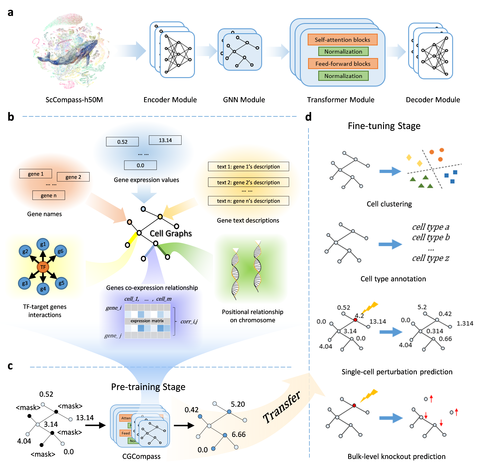

# Cell-GraphCompass: Open Source Code Repository

This is the open source code repository for the paper ["Cell-GraphCompass: Modeling Single Cells with Graph Structure Foundation Model."](https://www.biorxiv.org/content/10.1101/2024.06.04.597354v1) Cell-GraphCompass (CGCompass) is a graph-structured single-cell transcriptome foundational model. It uses six biological features to construct cell graphs and is pre-trained on fifty million human single-cell sequencing data.

## Overview


## Installation

```shell
conda create -n CGC python=3.9.16 R
conda activate CGC
pip install torch==1.13.0
pip install -r requirements.txt
```

We use the unicore framework to organize the code. You can download it from [here](https://github.com/dptech-corp/Uni-Core/archive/refs/tags/0.0.1.tar.gz) and install it as follows:

```shell
cd Uni-Core-0.0.1
python setup.py install
cd ..
```

## Directory Structure

- `/exps`: Contains shell scripts to start training or testing.
- `/src`: Contains the CGCompass model code.
- `/scData`: Contains data related to model training and testing.

Due to the large size of the model's weight parameters and database files, we stored them on [Google Drive](https://drive.google.com/drive/folders/1-0tE2jdodlUio2Wds61FKRE1E2Cd7MXU?usp=sharing). Users should download them first and then place them in the `/scData` directory.

## Model Training

Model training is initiated through unicore. The start command and hyperparameter settings are organized in shell scripts. Here are examples for three downstream tasks:

- `exps/cellClus.sh`: Cell clustering and batch correction.
- `exps/cellAnno.sh`: Cell type annotation.
- `exps/pert_norman`: Single-cell gene perturbation prediction.

The start command for model testing is placed after the corresponding shell script for training, and users can also use it independently.

## Example Experiment Guide

As an example, for cell clustering on the PCortex dataset, follow these steps:

Preprocess the original dataset as described in `scData/README.md` and `scData/example_datasets/README.md`.
We also provide a processed example database at `./scData/example_datasets/cellclus_PCortex`.
Then, tart the training and testing script:
   ```shell
   bash ./exps/cellClus.sh
   ```
   This bash script contains the hyperparameters used for the paper's results, which you can modify as needed.


## Cite Us

Please cite us as follows:
```
@article {Fang2024.06.04.597354,
  author = {Fang, Chen and Hu, Zhilong and Chang, Shaole and Long, Qingqing and Cui, Wentao and Liu, Wenhao and Li, Cong and Liu, Yana and Wang, Pengfei and Meng, Zhen and Pan, Jia and Zhou, Yuanchun and Feng, Guihai and Chen, Linghui and Li, Xin},
  title = {Cell-Graph Compass: Modeling Single Cells with Graph Structure Foundation Model},
  elocation-id = {2024.06.04.597354},
  year = {2024},
  doi = {10.1101/2024.06.04.597354},
  publisher = {Cold Spring Harbor Laboratory},
  URL = {https://www.biorxiv.org/content/early/2024/06/06/2024.06.04.597354},
  eprint = {https://www.biorxiv.org/content/early/2024/06/06/2024.06.04.597354.full.pdf},
  journal = {bioRxiv}
}
```
